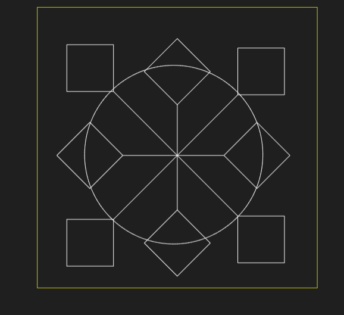
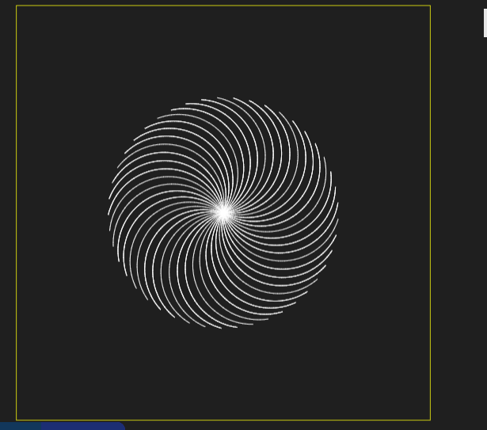
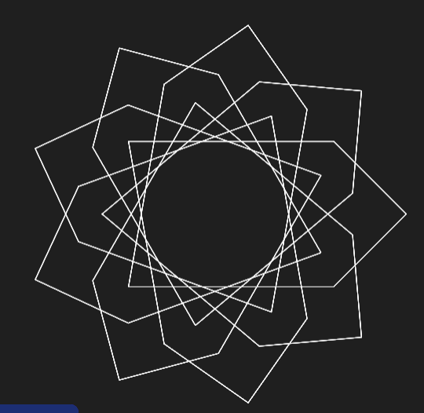

# Blot

just experimented around with turtle and blot. there's some random shapes and stuff. you can draw and experience them yourself by copying the code from any of the files and then running them on [blot](https://blot.hackclub.com/editor).

# hex.js
[hex](https://blot.hackclub.com/editor?shareId=0af10733-02b4-49a6-b497-04541afbf519)  

# spiral.js
[spiral](https://blot.hackclub.com/editor?shareId=a35d5ddb-97a8-4e80-b930-38a8dd7f3809)  

# new.js
[new](https://blot.hackclub.com/editor?shareId=28221b2e-d62c-41d3-bc96-555f893064aa)  
